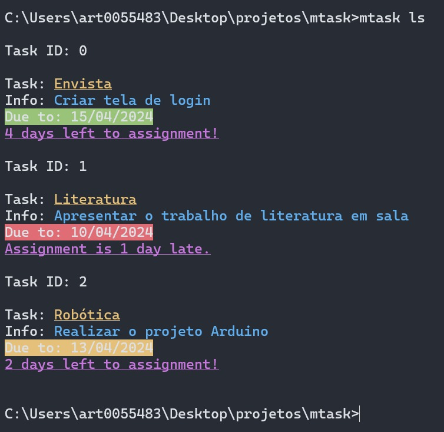

# MTask

Mtask is a Node.js CLI app for managing tasks.

## Setting it up

(Requires node)

Clone this repository, and on the project root folder, run:
`npm link`
And you're done!

## Adding tasks to the tasklist

You can add a new task by using:
`mtask add <task>`
and it will prompt you asking for info about the assignment.

## Viewing the checklist

You can check the current tasks available with:
`mtask list`

or use the shorthand:
`mtask ls`

## Removing a task

**_Only one element:_**
Say a task is already done, so you don't need it anymore.
To remove only one element, check the Task ID with `mtask ls` and run the following:

`mtask remove <task_id>`

**_Removing ALL tasks:_**
What if you already did all of 'em?
Well, you can remove all with:
`mtask removeall`

or use the ``mtask rmall` alias.

### Editing an existing task

To edit a task, check it's task ID and run:
`mtask edit <id> [options...]`

From here, there are a few options to run.

-   --task: Change the name of the task.
-   --desc: Change the task description.
-   --date: Change the assignment date.
